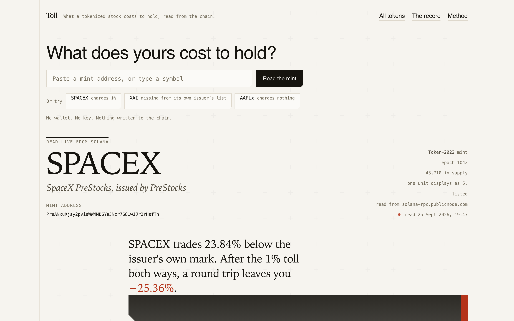
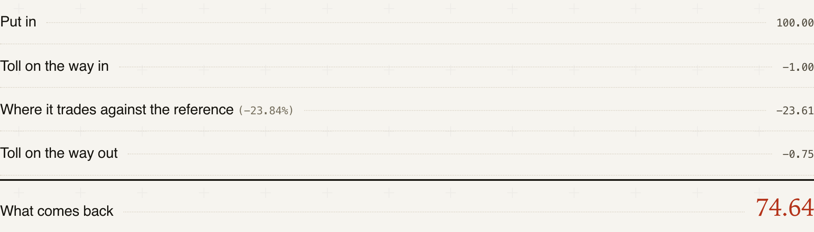
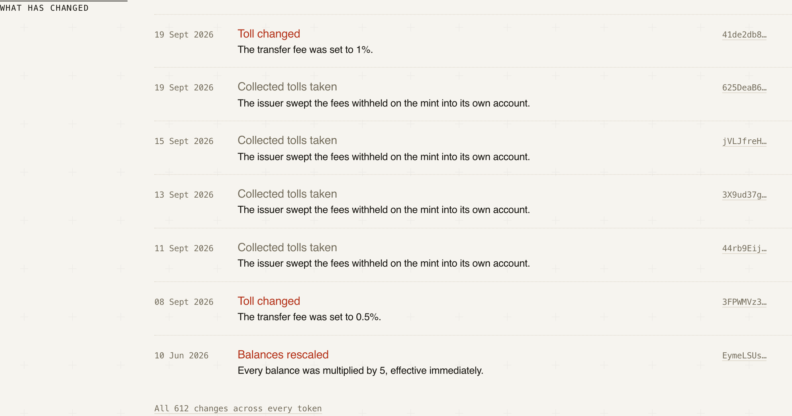
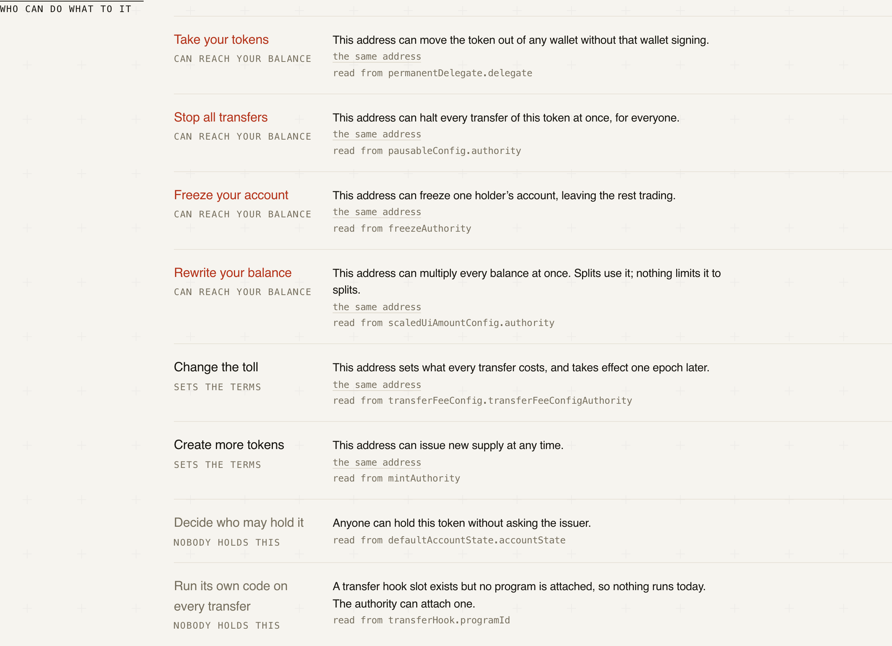
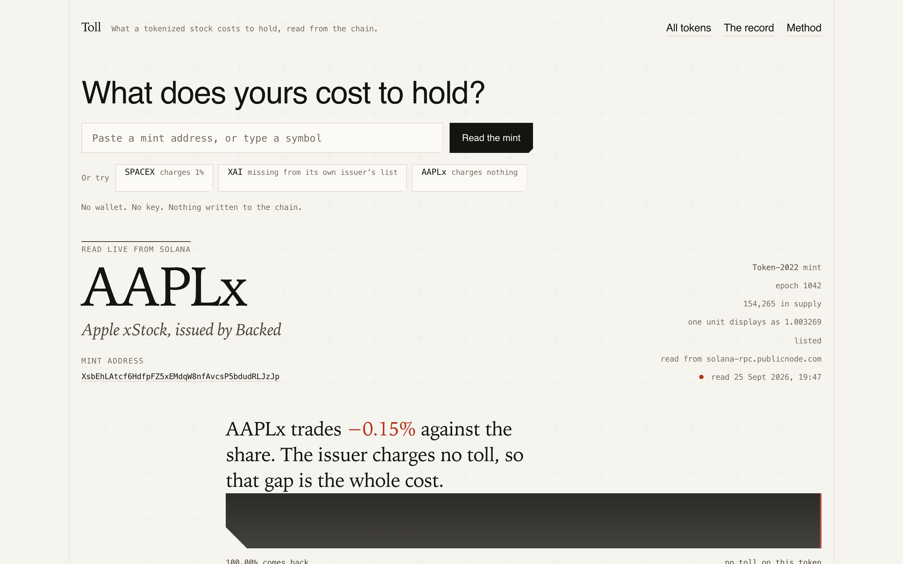

<div align="center">

# Toll

[](https://github.com/Yonkoo11/toll/actions/workflows/deploy.yml)


[](https://tollbar.xyz)

### Every tokenized stock has a toll and an owner of the switches. Both are on chain.

**Toll reads a tokenized-stock mint on Solana and answers one question: what does this cost to
hold? It names the transfer fee, what a round trip actually leaves you, who can seize or pause
or rewrite your balance, and when any of it last changed. Nine PreStocks mints had their toll
doubled from 0.5% to 1% inside eighteen minutes on 19 September 2026, and Toll rebuilds that
from the chain rather than asserting it.**

**[ Live ↗ ](https://tollbar.xyz)** · **[ Verify it yourself ↗ ](#verify-it-yourself)** · **[ The record ↗ ](https://tollbar.xyz/record)** · **[ Method ↗ ](https://tollbar.xyz/method)**

Built for Stocklana (Solana Foundation). Entering the main track, PreStocks and Pyth.

</div>

---

## Demo

**[Watch the pitch (1:19) ->](demo/toll-pitch.mp4)** · [the technical walk-through (2:07)](demo/toll-technical.mp4) · [vertical clip](demo/toll-social.mp4)

*Every frame below is a real run against mainnet. Nothing is mocked and no figure was typed in.
The narration does not read the figures aloud, on purpose: prices move between takes, and the
toll is the part that does not.*

| Ask about any mint, and read the answer | What a round trip actually returns | Nine mints, one day |
|---|---|---|
|  |  |  |

| Ranked by what it can do to you | A token that charges nothing |
|---|---|
|  |  |

---

## Table of contents

- [The problem](#the-problem) — what a quote does not tell you, and who holds the switches
- [What Toll is](#what-toll-is) — the four things it reads, in order
- [Verify it yourself](#verify-it-yourself) — four commands, and what each one prints
- [The thing that failed](#the-thing-that-failed-and-what-it-actually-was) — three days of a wrong error message
- [What is committed, and why](#what-is-committed-and-why) — the saved copies, each dated
- [What a browser can actually reach](#what-a-browser-can-actually-reach) — measured, endpoint by endpoint
- [What's real, and what I did not claim](#whats-real-and-what-i-deliberately-did-not-claim) — the honesty table
- [Project layout](#project-layout) · [Run it locally](#run-it-locally) · [Tech](#tech) · [Licence](#licence)

---

## The problem

- **The fee is not the price.** A venue quotes you a number. Token-2022's `transferFeeConfig`
  takes its cut inside the transfer, so the quote and the settlement differ, and a round trip
  pays it twice. On a 1% toll that is 1.99% gone before the price moves at all.
- **The terms change without notice, and quietly.** The same nine PreStocks mints were set to
  0.5% on 8 September 2026 and to 1% eleven days later. Both are on chain. Neither was a headline.
- **The switches have owners.** `permanentDelegate` can move your tokens without your signature.
  `pausableConfig` can stop every transfer. `scaledUiAmountConfig` can multiply every balance.
  On the nine PreStocks mints, **one address holds all six of the powers that anybody holds.**
- **A rescaled token prices wrong the obvious way.** SPACEX has a UI multiplier of 5, so asking
  a venue for a quote without dividing it out returns five times too much. My own first attempt
  did exactly that. It is now pinned by a check.

## What Toll is

A page that reads a mint and shows the answer, with the evidence next to every figure. The loop:

<div align="center">

**`READ THE MINT → PRICE IT BOTH SIDES → NAME THE POWERS → DATE EVERY CHANGE`**

</div>

1. **Read the mint.** One `getAccountInfo`, parsed for every Token-2022 extension. Two fee
   schedules live on a mint at once and switch by epoch, so Toll reads the one in force now.
2. **Price it both sides.** Jupiter for what a venue actually pays, Pyth's on-chain
   `PriceUpdateV2` account for what the share behind it is worth. Never blended.
3. **Name the powers.** Eight authorities, each rendered as what it can do to you, with the
   field it was read from printed underneath.
4. **Date every change.** The record is rebuilt from the issuers' own transaction history.

No wallet. No signing. Toll writes nothing to the chain.

## Verify it yourself

No key, no wallet, no account, no GPU. Every command below was run before it was written here,
on 23 September 2026, and the expected output is copied from that run.

```bash
git clone https://github.com/Yonkoo11/toll && cd toll
npm install

npx tsx scripts/verify-cost.ts   # → PHASE 2 GATE PASSED
npx svelte-check --threshold error   # → 0 ERRORS 0 WARNINGS
npm run build                        # → ✓ built

npm run verify                       # → GATE PASSED, 37 checks
```

All four pass. `verify-cost.ts` proves the cost engine against live mainnet. `npm run verify`
proves the mint reader the same way, rebuilds the 19 September record from the chain, and
checks that bad input fails with a usable message. None of it proves the browser front end;
that was checked by rendering it at 1440 and at three phone widths and looking, not by a test.

The fourth line was red for three days. What was wrong is the most interesting thing in this
repository, so it is written up below rather than quietly deleted.

## The thing that failed, and what it actually was

For three days this printed:

```
(c) the change tape: PreStocks doubled the toll
    TapeError: Read 12 of 100 transactions for WV9PJN7XTmTLVwbutCLFxp8TyePee6Xq5mRq6Fti5Wc;
    the record would be incomplete.
  hint: The public Solana endpoint is rate-limiting.
```

The hint was wrong. It was not rate limiting. Measured on 25 September against a signature
that is definitely on chain:

| endpoint | `getTransaction` |
|---|---|
| `api.mainnet-beta.solana.com` | serves it |
| `solana-rpc.publicnode.com` | returns `null` |
| `solana.api.onfinality.io/public` | `Too Many Requests` |

`publicnode` is not an archival node. It answers `null` for any historical transaction, which
is indistinguishable from "no such transaction". Worse, `null` arrives as a *successful* HTTP
response, so the client recorded that endpoint as the one that answered and preferred it from
then on. One account read was enough to poison every transaction read that followed. That is
how a rebuild reported 12 of 100 while the chain was reachable the whole time.

History is now only ever asked of a node that keeps it, and those calls are kept out of the
shared endpoint preference so they cannot steer the others. `src/lib/rpc.ts` carries the
measurements in a comment so the next person does not have to rediscover them.

**The part worth keeping:** before any of that was understood, this check was already failing
loudly rather than returning a short answer. Until 22 September it printed green, silently
discarding every transaction the endpoint would not serve and reporting what was left as the
complete record. A week in which the issuer changed nine mints looked identical to a quiet one.
That is the exact failure this project exists to catch, and it was inside the project. A null
became an incomplete read, and an incomplete read throws. It stayed red for three days because
of it, which is the correct behaviour, and it is how the real cause was eventually found.

`public/tape.json`, 612 dated changes, is committed and was unaffected throughout.

## What is committed, and why

Four files ship as data rather than being read live, each because a browser cannot reach the
source. Every one is dated on the page and labelled as a saved copy.

| File | Rows | Why it is not read live |
|---|---|---|
| `public/tape.json` | 612 changes | Rebuilding it needs ~100 transaction reads; the free endpoint refuses most of them |
| `public/pyth-accounts.json` | 64 feeds | Pyth has no derivable address, so a live lookup meant scanning 11,398 accounts per feed |
| `public/marks.json` | 8 marks | `prestocks.com/api/prestocks` sends no CORS headers; a page cannot read it at all |
| `data/catalog.json` | 265 tokens | Built from what the admin addresses have touched, not from any issuer's published list |

## What a browser can actually reach

The engine ran against Node for two days. Three sources that answer Node refuse a page, and all
three were found by rendering the site and looking at it:

| Source | From Node | From a browser page |
|---|---|---|
| `api.mainnet-beta.solana.com` | works | **403 on every request** |
| `prestocks.com/api/prestocks` | works | **no CORS headers, unreadable** |
| `solana-rpc.publicnode.com`, 20 accounts at once | works | **403; 5 at once returns 200** |

Toll carries a keyless endpoint list, remembers which one answered, and prints its name on the
page. Six other public endpoints were tried and are unusable from a browser: ankr, helius demo,
getblock, blockeden, grove, leorpc.

## What's real, and what I deliberately did not claim

| Capability | Status |
|---|---|
| **Reads any Token-2022 mint and names its fee, powers and epoch schedule** | Real. Part of 37 checks against live mainnet on two issuers with opposite behaviour. |
| **Round-trip cost net of the toll** | Real. `verify-cost.ts` passes against mainnet. |
| **265 tokens catalogued** | Measured, not asserted. Built from admin transaction history, which is why it includes XAI, a live mint the issuer's own published list omits. |
| **Only 64 of the 252 Pyth feeds these tokens name have a price account on Solana** | Measured. One scan of 11,398 accounts. |
| **Live rebuild of the change record** | **Currently failing.** The free endpoint serves 39 of 100 transactions. The committed record is complete; the live rebuild is not. |
| **The issuer's mark on pre-IPO names** | Degraded, and labelled as such on the page. A dated saved copy, because the API sends no CORS headers. |
| Price prediction, scoring, risk ratings | Not claimed, anywhere. Toll reports what is on chain and does not tell you what it means for the price. |
| Front-end test suite | Does not exist. The five pages were checked by rendering them at 1440 and 390 in Chromium and Firefox and looking at them. |
| Safari | Untested. No WebKit build here close enough for a result to mean anything. |
| Audited | No. Nothing here has been reviewed by anyone but me. |

## Project layout

```
src/
  lib/rpc.ts        # keyless JSON-RPC, endpoint list, remembers which answered
  lib/terms.ts      # Token-2022 extension parsing; the epoch-gated fee schedule
  lib/tape.ts       # the change record; throws rather than return a short one
  lib/cost.ts       # round-trip cost, premium, the verdict sentence
  lib/prices.ts     # Jupiter quote, Pyth on-chain read, issuer mark
  lib/base.ts       # every asset and route path, so it works at any mount point
  routes/           # the five pages
  components/       # ledger, toll bar, powers, change rows
scripts/
  verify.ts         # the mint-reader gate, live mainnet
  verify-cost.ts    # the cost-engine gate, live mainnet
  build-tape.ts     # rebuilds public/tape.json
  build-pyth-accounts.ts  # the one-off 11,398-account scan
design/             # the chosen direction, the build brief, the social card
```

## Run it locally

```bash
npm install
npm run dev       # http://localhost:5173
npm run build     # writes dist/ plus 404.html for hosts with no history fallback
npm run tape      # rebuild the change record (needs an endpoint that serves history)
```

## Tech

**Language:** TypeScript · **Front end:** Svelte 5 + Vite, no router or UI dependency ·
**Chain:** Solana mainnet, Token-2022 · **Prices:** Pyth on-chain `PriceUpdateV2`, Jupiter ·
**Site:** [tollbar.xyz](https://tollbar.xyz) · **Keys required:** none, anywhere.

## Licence

MIT. See [LICENSE](LICENSE) and [CONTRIBUTING.md](CONTRIBUTING.md).

Toll stores nothing about you. There is no analytics script, no cookie and no back end: the page
reads public accounts from a public endpoint in your own browser.
